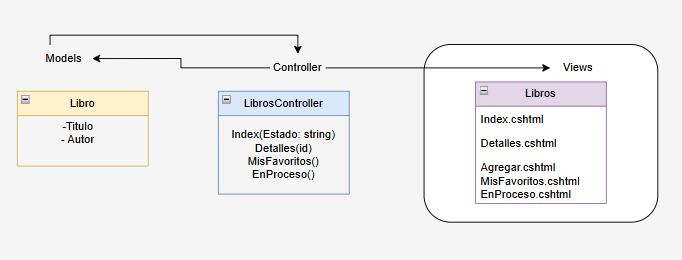
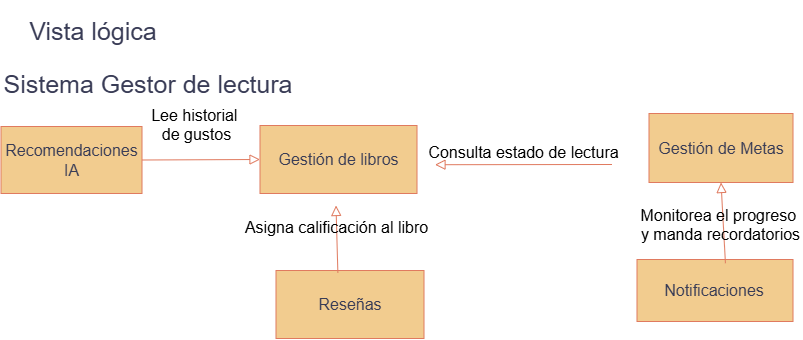
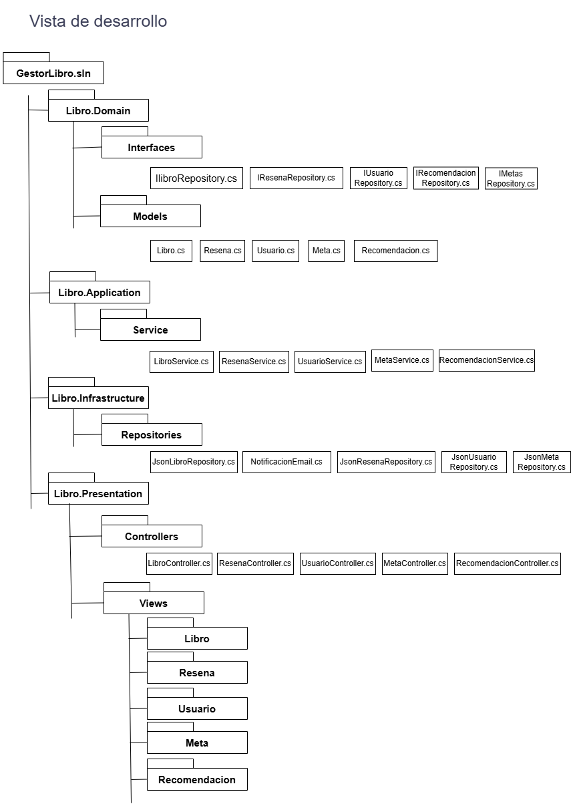
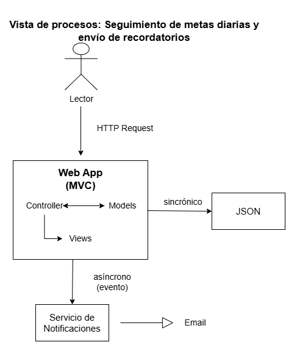
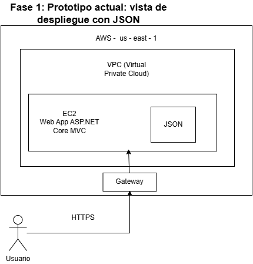
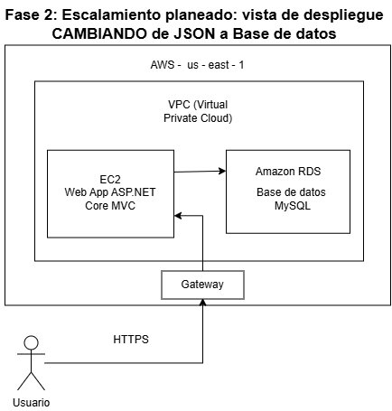

# ADR-02: Magic library - Definición de Vistas Arquitectónicas bajo el Patrón MVC

| Campo  | Valor |
|--------|-------|
| Autor  | Astrit Cetzal |
| Fecha  | 05/06/2026 |
| Estado | 'Aceptado' |

 Remplazado por ADR-02

---

## Contexto

### Descripción del sistema
Estoy en proceso de construcción de un sistema que administre los libros leídos, los libros pendientes y los que estan en proceso de lectura. La idea de este sistema surge porque muchos lectores (en especial aquellos que solo leen en linea y descargan PDFs en internet) llegan a olvidar que libros han leido, cuales estapan leyendo o cuales dejaron pendientes. 
Para este proyecto usaré visual estudio, trabajaré con el Framework de .net y usaré el patrón MVC y claro el lenguaje principal para mi app es C#.

### Primera idea del sistema
Principalmente tenia en mente un sistema que administre el dinero que gasto, sin embargo me convencio mas el proyecto de los libros, entonces opte por Magic Library el cual lo considero adecuado para poder realizarlo en este cuatrimestre.

### Funcionalidades
- Magic library busca llevar un registro de los libros que el usuario ha leído, los que está leyendo actualmente y los que tiene pendientes.
- El usuairo puede establecer cuantos libros quiere leer este año 
- El sistema permitirá establecer metas diarias de lectura para fomentar el hábito de la lectura.
- También se podrán agregar notas o comentarios sobre cada libro para recordar detalles importantes o reflexiones personales.
- Este sistema planea incluir Inteligencia Artificial para recomendar libros basados en las preferencias del usuario y su historial de lectura.
- Además, se planea implementar una función de seguimiento del progreso de lectura, donde el usuario pueda marcar los capítulos o páginas que ha leído y recibir estadísticas sobre su avance.
- El usuario podrá resibir notificaciones para recordar sus metas diarias de lectura o para sugerir nuevos libros basado en sus intereses. 

---

## Decisión

#### MVC 

### ¿Por qué?

Este patrón arquitectónico separa 3 responsabilidades:
- Model: los datos y las reglas de negocio. No sabe que existe una pantalla. 
- View: lo que ve el usuario. No consulta datos por sí misma.
- Controller: Recibe peticiones y es el intermediario entre la vista y el modelo. No genera HTML.

Me convence más este patrón porque es fácil de entender y tiene una gran comunidad de soporte. 

### Atributos de calidad estáticos por el cual elegí este patrón
- **Mantenibilidad**: Al separar las responsabilidades, es más fácil de mantener y actualizar el sistema. Si necesito cambiar la forma en que se muestran los datos, solo tengo que modificar la vista sin afectar el modelo o el controlador.
- **Escalabilidad**: Al tener una estructura clara, es más fácil de escalar el sistema a medida que crece. Puedo agregar nuevas funcionalidades sin afectar las partes existentes.
- **Modularidad**: Cada componente (modelo, vista, controlador) es independiente, lo que facilita la reutilización de código y la colaboración entre desarrolladores.

### Alternativas consideradas

| Alternativa | Por qué la descarté |
|-------------|---------------------|
| MVVM         | la view y viewmodel se sincronizan y no hay controller.                  |
| MVP         | Android nativo; la view es muy “pasiva”, no toma ninguna decisión.                 |
| Hexagonal         | más para sistemas empresariales.                  |

---

## Consecuencias

**✅ Lo que gano:**

- Escalabilidad: Al separarlo en responsabilidades se vuelve más fácil de escalar y permite que se agreguen más funcionalidades. Cada componente se puede desarrollar, mantener y probar por separado. 
- Control del desarrollo: Al ser un desarrollo individual, adoptar la estructura estricta de carpetas de MVC reduce la carga de decisiones . El patrón dicta donde colocar cada archivo, lo que acelera el flujo de trabajo y mantiene el código organizado.

**⚠️ Lo que sacrifico o asumo:**

- Introduce complejidad: la aplicación requiere más archivos y carpetas lo que puede ocasionar que sea más difícil de entender y seguir. 
- Acoplamiento web: Si el proyecto escala en el futuro y se quiere una aplicación movil nativa, se tendria que contruir una API REST separada, debido a que actualmente la interfaz estaria fuertemente ligada al servidor. 

## Trade-offs arquitectonicos de Magic library:

| Decesión | Atributo que prioriza | Atributo que prioriza |
|-------------|---------------------|---------------------|
| MVC en lugar de API + frontend separado         | Simplicidad de desarrollo                  | Flexibilidad para una Aapp móvil futura.                  |
| Datos en memoria vs base de datos         | Velocidad de prototipado ahora                 | Persistencia real                  |
| Un solo EC2 vs un balanceador de carga         | Costo mensual bajo                  | Disponibilidad si el servidos falla                  |
| Envío de notificaciones síncrono         | Confirmación inmediata al usuario                  | El sistema se bloquea si el servicio de email falla.                  |

## Decisión de los diagramas de vistas arquitectónicas

### *Vista lógica*
Se decidió posicionar "Gestor de libros" como el módulo central del sistema, ailando las "mets" y las "Recomendaciones IA" como modulos satélites que consumen inforamción del nécleo. Lo deseñé asi pqra que si el dia de mañana quiero cambiar la forma en que la UA hace las recomendaciones, el ssitema principal de mi libros no se vea afectado para nada.

### *Vista física / desarrollo*
Para organizar el código me apegué a la estructura de carpetas que imide el patrón MVC. Además, sgregué las carpteas de insfrsatructura y Dominio (para las interfaces) porque quiero usar inyeccción de dependencias. Tomé esta decision porque hace que el código sea mucho mpas ordenado y me facilita encontrar los errores rápido cuando estoy programando.

### *Vista de procesos*
En el flujo de las metas y los recordatorios, tompe la decisión de usar un flujo mixto. Cuando el usuario registra lo que leyó, eso se guarda de forma sincrónica. Sin embargo, el envio del correo de cotificación funciona de forma asíncrona. Esto es clave porque asi evito que la pantalla del usuario se quede congelada o cargando mientras se envía el correo, lo que mejora la experiencia del usuario.

### *Vista de despliegue*
Para esta vista decidí documentar 2 escenarios para mostrar como va a evolucionar el proyecto:

Fase 1 (actual): es como lo tengo ahora. El sistema corre en local y los datos se guardan en un archivo JSON. Esto lo decidí peara poder desarrollar la lógica más rápido sin complicarme con servidores todvia.

Fase 2 (Futuro): es mi plan para subir el proyecto a producción con AWS. La idea es poner la aplicación web en un servidos EC2 y cambiar el archivo JSON por una base de datos MySQL en RDS. Todo esto viviria dentro de una red privada (VPC) para que sea seguro y pueda aguantar si el proyecto crece. 

## Diagrama 

## Diagrama  - vistas arquitectónicas

### Vista lógica:
#### Se muestran los modulos principales del sistema y sus relaciones.

### Vista de desarrollo:
#### Se muestra como está organizado el código en carpetas y archivos, siguiendo la estructura del patrón MVC.

### Vista de procesos:
#### Se muestra el flujo de procesos y cómo interactúan los diferentes componentes del sistema.

### Vista de despliegue:

#### La primera imagen se adapta a como estoy implementando el sistema actualmente usando archivos JSON

#### La segunda imagen se adapta a como planeo implementar a futuro sustituyendo JSON por la base de datos relacional MySQL. 

## Declaración de uso de IA
Declaro que utilicé inteligencia artificial (Gemini), para los diagramas solo utilicé para revisar que estuvieran correctos, ya que no me encontraba convencida. Con respecto a la redacción de este ADR, utilicé la IA para revisar la redacción y la ortografía del contexto, la IA de visual me proporcionaba opciones de autocompletado para las frases y si me convencían las usaba, si no, las modificaba.