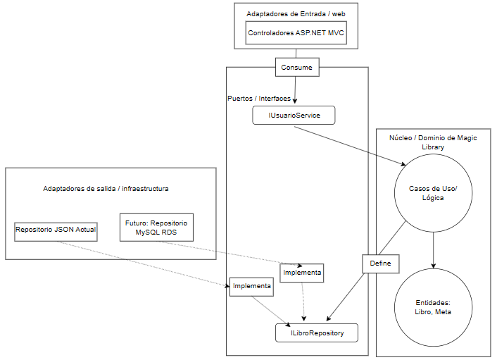

# ADR-03: Magic library - Definición de Estilo arquitectónico

| Campo  | Valor |
|--------|-------|
| Autor  | Astrit Cetzal |
| Fecha  | 19/06/2026 |
| Estado | `Aceptado` |

 Remplazado por ADR-02

---

### Contexto

El sistema requiere comunicación externa para permitir que otras aplicaciones o dispositivos (como una App movel o frontend) consuman los datos de Magic Library. Actualmente el acceso a datos es lcal (archivos JSON), lo cual es insuficiente para un entorno de producción donde se requiere concurrencia y acceso remoto.

---

## Decisión 
Implementar una API REST utilizando ASP.Net Core Web Api y documentarla con Swagger/OpenApi

### ¿Por qué?
1. Estandar de la industria: REST es el lenguaje universal de la web.
2. Desacoplamiento: Permite que el frontend y el backend evoluciones de forma independiente.
3. Swagger: Permite documentar automáticamente los endpoints (Books y Recommendations), facilitando la validación del sistema por terceros.

### Alternativas consideradas

| Alternativa | Por qué la descarté |
|-------------|---------------------|
| gRCP         | Es excelente para comunicación interna entre servicios, pero es difícil de probar y consumir desde navegadores (requiere librerías adicionales).                   |
| Capas         | Ofrece flexibilidad, pero para este sistema de lectura, REST cubre las necesidades con mucha menos complejidad de configuración.                  |
| Monolitico         | Son tecnologías obsoletas y demasiado pesadas/verbosas para un proyecto moderno en .NET. MVC hace que el código sea difícil de probar.                 |

---

## Consecuencias

**✅ Lo que gano:**

- Consecuencia técnica: Cuando migre de JSON  a MySQL será un proceso limpio esto gracias a la inyección de dependencias. Lo que permite escalabilidad.
- Consecuencia sobre el proceso: Puedo enfocarme primero en la lógica de negocio y luego realizar las configuraciones dificiles de la base de datos para el final.
- Testeabilidad: al tener el dominio aislado de los archivos JSON y la vista, puedo realizar puebras unitarias rápidas solo para las reglas de mis libros y metas. 
- Mantenibilidad: El aislamiento asegura que cuando migre la infrastructura de JSON  a MySQL, el riesgo de introducir bugs en la lógica central de Magic Library es casi nulo. 
- Uso en móviles: gracias a la inyeccción de dependencias puedo agregar un nuevo proyeto. Dicha API será el nuevo adapter de entreda. 

**⚠️ Lo que sacrifico o asumo:**

- Limitación técnica: se requiere la creación de más archivos para operaciones simples que en otros estilos tomarían un solo archivo.
- Deuda o riesgo: Existe el riesgo de OverKill. Debo mantener los puertos y adaptadores lo más simples posibles para no complicar un CRUD.
- Eficiencia en el desarrollo inicial: La estructura multiproyecto requiere crear más abstracciones, interfaces y configurar más inyecciones de dependencias por lo que a diferencia de otros sistemas que tomaria un minuto, con este se requiere la creación de varios archivos. 
- Rendimiento: El uso excesivo de interfaces y la división de la memoria entre las diferentes capas añade un overhead computacional en comparación con hacer llamadas directas, aunque para este sistema es imperceptible. 

## Diagrama

### Cláusula de uso de IA

Se declara el uso de inteligencia artificial de manera asistida, por lo que se requirió para validar información, entender mejor la diferencia entre cada uno de los modelos de arquitectura y como apoyo para validar la información escrita y para ayudar a mejorar la ortografia. 

