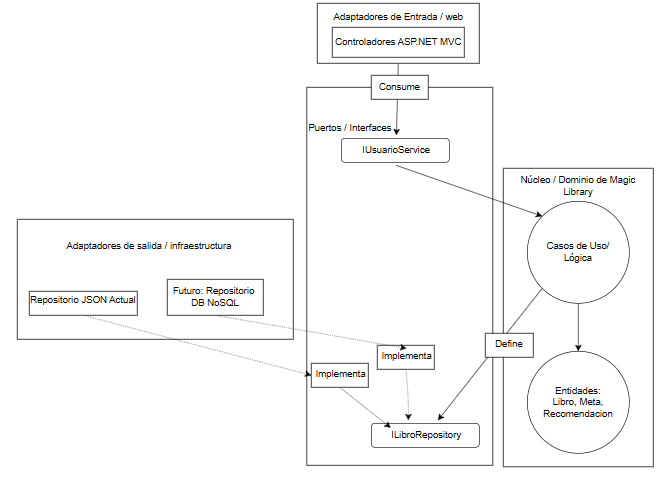

# ADR-04: Magic library - API REST

| Campo  | Valor |
|--------|-------|
| Autor  | Astrit Cetzal |
| Fecha  | 19/06/2026 |
| Estado | `Remplazado por ADR 5` |

 

---

### Contexto

El sistema requiere comunicación externa para permitir que otras aplicaciones o dispositivos (como una App movel o frontend) consuman los datos de Magic Library. Actualmente el acceso a datos es lcal (archivos JSON), lo cual es insuficiente para un entorno de producción donde se requiere concurrencia y acceso remoto.

---

## Decisión 
Implementar una API REST utilizando ASP.Net Core Web Api y documentarla con Swagger/OpenApi

### ¿Por qué?
1. Estandar de la industria: REST es el lenguaje universal de la web.
2. Desacoplamiento: Permite que el frontend y el backend evolucionen de forma independiente.
3. Swagger: Permite documentar automáticamente los endpoints (Books y Recommendations), facilitando la validación del sistema por terceros.

### Alternativas consideradas

| Alternativa | Por qué la descarté |
|-------------|---------------------|
| gRPC         | Es excelente para comunicación interna entre servicios, pero es difícil de probar y consumir desde navegadores (requiere librerías adicionales).                   |
| GrapghQl         | Ofrece flexibilidad, pero para este sistema de lectura, REST cubre las necesidades con mucha menos complejidad de configuración.                  |
| SOAP/WCF         | Son tecnologías obsoletas y demasiado pesadas/verbosas para un proyecto moderno en .NET. MVC hace que el código sea difícil de probar.                 |

---

## Consecuencias

**✅ Lo que gano:**

- Técnica: La API expone los datos de maner estructurada (JSON), haciendo que la migración a una base de datos sea invisible para el cliente.
- Proceso: La documentación automática con swagger que permite probar la API al instante sin tener que crear un frontend complejo para validar los endpoints.

**⚠️ Lo que sacrifico o asumo:**

- Seguridad: Al abrir endpoints, asumo la responsabilidad de implementar autenticación (JWT) en futuras entregas, ya que actaulmente están abiertos.
- Latencia: Al pasar de lectura de archivos locales a peticiones HTTP, el tiempo de respuesta aumenta ligeramente debido al stack de red. 

### Estrategia de persistencia y producción 
- Acceso a datos en producción: Migraré de archivos JSON  a una Base de datos NoSQL (como MongoDB o DynamoDB).
- ¿Por qué NoSQL? La naturaleza del catalogo requiere flexibilidad para los datos restructurados. Sin embargo, para los archivos pesados, usaré un servicio de almacenamiento de objetos como Amazon S3, guardando unicamente la URL pública de la imagen en la base de datos NoSQL.. Esto evita sobrecargar la base de datos, reduce la latencia de la peticiones HTTP y sigue las mejores practicas de escalabilidad y optimización de costos.

## Endpoints 

### Todos los libros

### Libro por ID

### Todas las recomendaciones

### Libro recomendado por ID

### Filtrar libro por género

## Diagrama

### Cláusula de uso de IA

Se declara el uso de inteligencia artificial como herramienta de apoyo para el diseño de la arquitectura de la API en la correción de errores y la generacion de datos de pruba para las recomendaciones y para esta se basó de mis libros registrados en "libro.json".

