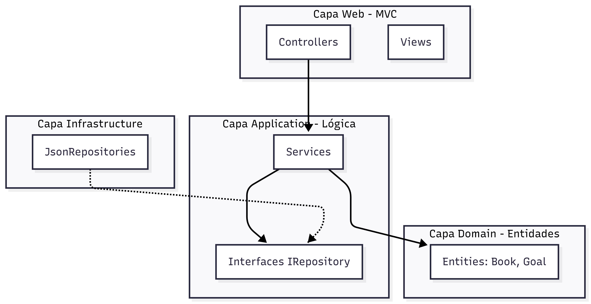

Portada
Breve introducción (nombre del proyecto, qué hace, qué resuelve)
Estado en la Unidad I
Agradecimientos

# ADR-01: [Título corto de la decisión]

| Campo  | Valor |
|--------|-------|
| Autor  | Astrit Cetzal |
| Fecha  | 26/06/2026 |
| Estado | `Aceptado`  |

---

## Contexto

Magic library es una plataforma de gestion de hábitos de lectura. El sistem permte registrar libros, gestionar metas de lectura. El sistema permite registrar libros, gestionar metas de lectura y recibir recomendaciones. 
Actualmente, el proyecto utiliza una Arquitectura Hexagonal, lo que requiere una clara separación de responsabiliddes y desacomplamiento entre las cpas de Domain, Application, Infrastructure y Web.

Debido a que el sistem está en una etapa de evoluvión constante (de JSON a futuras bases de datosm y de vistas estáticas a consultas más dinámicas), enfrento el reto de mantener el código limpio, escalable y siguiendo los principios SOLID. El tiempo de entrea el limitado, por lo que busco soluciones robustas que eviten el "código espagueti" conforme agrego funcionalidades como notificaciones o reportes.

---

## Decisión

>  Patrones de diseño GOF
- Factory Method (Credencial) implementando la creacion de los repositorios de datos.

- Decorator (Estructural): Implementando para extender dinámicamente la funcionalidad de los resultados de búsqueda/consulta de libros.

- Observer (Comportamiento): Para enviar una notificacion cada vez que se agregan libros a la meta.

### ¿Por qué?

- Factory: Para crear objetos sin saber exactamente cual, porque mientras este en desarrollo se van a consultar los datos del JSON y cuando esté en producción se establece por el momento a memoria, per más adelante lo voy a establecer para una base de datos. Lo elegí porque en mi arquitectura hexagonal necesito que la capa de Application no sepa cómo se instancia el repositorio (si es un JsonBookRepository o en el futuro un SqlBookRepository). El patrón Factory centraliza esta creación, permitiendo que mi sistema sea "agnóstico" a la tecnología de persistencia.
- Decorator: Me permite añadir comportamientos extra sin modificar la clase base Book, respetando el principio de Abierto/Cerrado.
- Observer: Lo elegí para desacoplar el sistema de metas de la lógica de notificaciones. Cuando un usuario marca una meta o agrega un libro, el GoalService no necesita saber cómo se envía el mensaje (WhatsApp, correo, etc.); el Observer notifica a los suscriptores registrados automáticamente.

### Alternativas consideradas

*(Mínimo 3 filas)*

| Alternativa | Por qué la descarté |
|-------------|---------------------|
| Simple Factory (Solo instanciación)         | Es menos flexible que el Factory Method; el Factory Method permite sub-clases para decidir qué instanciar sin cambiar el cliente.                 |
| Inheritance (Herencia para extender)         | La herencia es rígida y causa una explosión de clases si quiero combinar varias funciones (ej: un libro decorado con 'Alerta de Tiempo' y 'Alerta de Género').                 |
| Service Locator         | Es considerado un anti-patrón en arquitecturas modernas y rompe la inyección de dependencias que ya tengo configurada en .NET.                 |

---

## Consecuencias

**✅ Lo que gano:**

> Técnica: * Escalabilidad: El Factory permite cambiar la base de datos sin tocar la lógica.

- Flexibilidad: El Decorator permite enriquecer los datos de libros sin tocar el núcleo.

- Desacoplamiento: El Observer permite que el sistema de notificaciones sea opcional y fácil de escalar a otros canales (ej: notificaciones push).

> Proceso: Facilita el trabajo en equipo; cada patrón aísla una responsabilidad, permitiendo modificar notificaciones sin tocar la persistencia de datos.

**⚠️ Lo que sacrifico o asumo:**

Menciona al menos:
- Limitación técnica: El uso de Factory y Observer añade una capa de indirección, lo que puede hacer que el flujo de depuración sea más complejo al inicio.

- Riesgo: Un uso excesivo de Observer puede generar "efectos secundarios" difíciles de rastrear si no se documenta bien qué componentes están escuchando a quién.

## Diagrama

