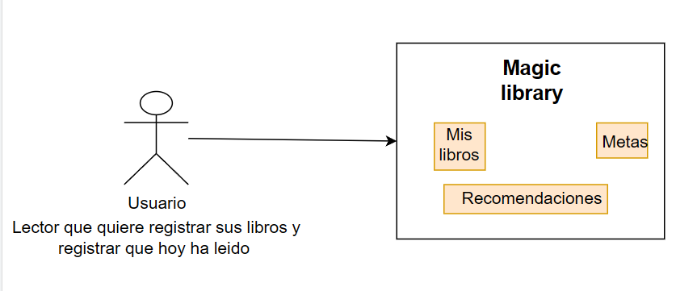
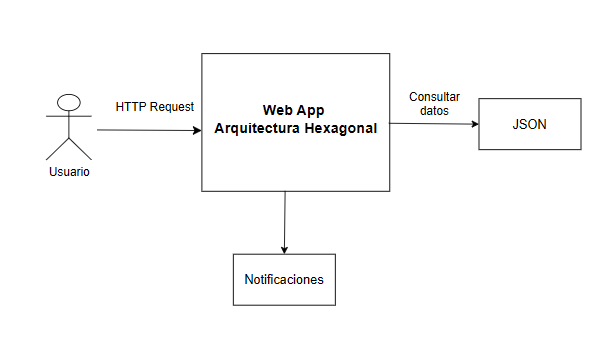
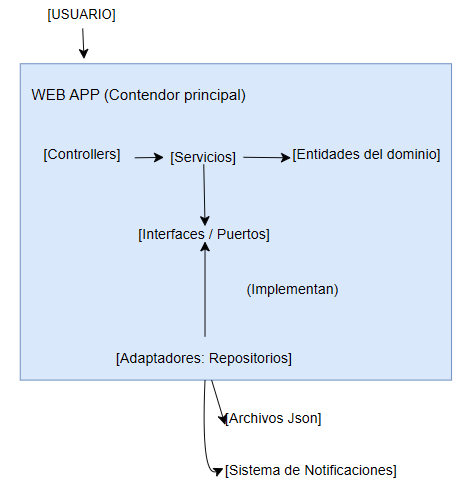

# ADR-05: Patrones GOF implementados

| Campo  | Valor |
|--------|-------|
| Autor  | Astrit Cetzal |
| Fecha  | 15/07/2026 |
| Estado | `Aceptado`  |

---

## Contexto

Magic library es una plataforma de gestion de hábitos de lectura. El sistem permte registrar libros, gestionar metas de lectura. El sistema permite registrar libros, gestionar metas de lectura y recibir recomendaciones. 
Actualmente, el proyecto utiliza una Arquitectura Hexagonal, lo que requiere una clara separación de responsabiliddes y desacomplamiento entre las cpas de Domain, Application, Infrastructure y Web.

Debido a que el sistem está en una etapa de evoluvión constante (de JSON a futuras bases de datosm y de vistas estáticas a consultas más dinámicas), enfrento el reto de mantener el código limpio, escalable y siguiendo los principios SOLID. El tiempo de entrea el limitado, por lo que busco soluciones robustas que eviten el "código espagueti" conforme agrego funcionalidades como notificaciones o reportes.


---

## Decisión 1: Implementación de Patrones de Diseño (GOF)

>  Patrones de diseño GOF
- Factory Method (Credencial) implementando la creacion de los repositorios de datos.

- Decorator (Estructural): Implementando para extender dinámicamente la funcionalidad de los resultados de búsqueda/consulta de libros.

- Observer (Comportamiento): Para enviar una notificacion cada vez que se agregan libros a la meta.

### ¿Por qué?

- Factory: Para crear objetos sin saber exactamente cual, porque mientras este en desarrollo se van a consultar los datos del JSON y cuando esté en producción se establece por el momento a memoria, pero más adelante lo voy a establecer para una base de datos. Lo elegí porque en mi arquitectura hexagonal necesito que la capa de Application no sepa cómo se instancia el repositorio (si es un JsonBookRepository o en el futuro un SqlBookRepository). El patrón Factory centraliza esta creación, permitiendo que mi sistema sea "agnóstico" a la tecnología de persistencia.
- Decorator: Me permite añadir comportamientos extra sin modificar la clase base Book, respetando el principio de Abierto/Cerrado.
- Observer: Lo elegí para desacoplar el sistema de metas de la lógica de notificaciones. Cuando un usuario marca una meta o agrega un libro, el GoalService no necesita saber cómo se envía el mensaje (WhatsApp, correo, etc.); el Observer notifica a los suscriptores registrados automáticamente.


## Implementacion de GOF

Factory por el momento tengo establecido un archivo para que se guarde en memoria los datos en producción pero más adelante lo cambiare por una base de datos

````
public static IBookRepository AgregarLibroRepository(string entorno, IWebHostEnvironment env)
        {
            return entorno switch
            {
                "Production" => new MemoryBookRepository(),
                _ => new JsonBookRepository(env)
            };
        }
````

Decorator 
La clase LoggingBookRepository actúa como el decorador de infraestructura: implementa la interfaz IBookRepository y recibe otra instancia de la misma interfaz a través de su constructor para envolverla. Esto permite auditar y verificar el estado de disponibilidad de la información en tiempo de ejecución dentro de los siguientes métodos:

```
public List<Book> ObtenerTodos()
public Book? ObtenerPorId(int id)

```

Observer - La principal funcion es que notifique cuando el usario agregue un libro en Metas, implementa de `IGoalObserver`y en `GoalService` tenemos el método para confirmar el libros agregado

### Service
```
public void ConfirmarLibroAgregado(Goal goal)
        {
            //notificar 
            foreach (var observer in _observers)
            {
                observer.OnSavedBook(goal);
            }

        }

````
### Interfaces

````
 public interface IGoalObserver
    {
        void OnSavedBook(Goal goal);
    }
````
### Infrastructure

````
public class EmailObserver: IGoalObserver
    {
        public void OnSavedBook(Goal goal) => Console.WriteLine($"[Email] Haz agregado un nuevo libro a tu meta {goal.IdMeta} - Ahora tienes {goal.LibrosAsignados.Count} libros asignados");
    }

````

## Decisión 2: Inversión de Dependencias (Principios SOLID)

*   Implementar interfaces estrictas para la capa de servicios (crear `IBookService`, `IGoalService`, `IUserProfileService` dentro de `MagicLibrary.Application.Interfaces`).
*   Inyectar estas interfaces en los controladores en lugar de inyectar las clases concretas (`BookService`, `GoalService`).
*   Asegurar que la capa Web (Adaptador de entrada) dependa exclusivamente de abstracciones, cumpliendo con el Principio de Inversión de Dependencias (la "D" de SOLID) y disminuyendo el acoplamiento.

---


### Alternativas consideradas


| Alternativa | Por qué la descarté |
|-------------|---------------------|
| Simple Factory (Solo instanciación)         | Es menos flexible que el Factory Method; el Factory Method permite sub-clases para decidir qué instanciar sin cambiar el cliente.                 |
| Inheritance (Herencia para extender)         | La herencia es rígida y causa una explosión de clases si quiero combinar varias funciones (ej: un libro decorado con 'Alerta de Tiempo' y 'Alerta de Género').                 |
| Service Locator         | Es considerado un anti-patrón en arquitecturas modernas y rompe la inyección de dependencias que ya tengo configurada en .NET.                 |

---

## Desición 3: Identificación y refactorización de Code Smells

Idetificar y erradicar vicios de código en la capa de presentación mediante las siguiente refactorización:

### Code Smell 1: Long Method y Tight Coupling
* **Ubicación**: `GoalController`, método `Index()`.
* **Como solucionarlo**:
    1. Aplicar la técnica *Estract Method*
    2. Extraer el bloque de código iterativo (`foreach`) responsable de realizar cálculos matemátocamente sobre los libros asiganodos.
    3. Trasladar dicha lógica hacia un nuevo método `CalcularTotalPaginasPendientes(Goal meta)` en la capa de Aplicación.
    4. Invocar el nuevo método desde el controlador,

### Code Smell 2: Feature Envy (Envidia de Funcionalidad)
* **Ubicación**: `GoalController`, método `MarcarCompletado(string tituloLibro)`.
* **Como solucionarlo**:
    1. Applicar la técnica *Move Method*.
    2. Retirar del controlador las decisiones de negocio (buscar el libro en otros servicios, transformar recomendaciones en libros nuevos y cambias estados).
    3. Encapsular toda esta lógica en un método unificado dentro de la capa de Aplicación.
    4. Limitar el controlador a recibir la petición y delegar la acción al servicio.

----   

## Desición 4: Documentación y Mitigación de Deuda técnica

### Deuda Técnica 1: Infraestructura y configuración 
* **Qué es**: Rutas estáticas de archivos JSON escritas a mano (*hardcodeadas*) directamente dentro de las clases de la capa de Infraestructura.
* **Por qué existe**: Decisión consciente asumida para lograr un prototipado veloz en un entorno local y cumplir con fechas de entrega sin tener que configurar variables de entorno complejas.
* **Costo de no pagarla**: Romper por completo la aplicación al momento de desplegarla en un servidor en la nube. Las rutas del sistema de archivos en producción serán distintas; si la deuda crece, será necesario modificar el código fuente y recompilar la aplicacióncada vez que se cambie de entorno.
* **Propuesta de solución**: Inyectar la interfaz `IConfiguración` para leer el nombre y la ubicación de los archivos de forma dinámica a traves de variables de entorno del sistema operativo.

### Deuda Técnica 2: Seguridad en lógica de Negocio
* **Qué es**: Almacenamiento y validación de contraseñas de usuarios en texto plano directamente en la base de datos (`ùsers.json`) y en el método de autenticación.
* **Por qué existe**: Descuido tolerado de forma temporal para validar con rápidez el funcionamiento del flujo de inicio de sesipon y la generación de *Cookies*, priorizando la interfaz gráfica del backend.
* **Costo de no pagarla**: Generar una vulnerabilidad crítica. Comprometer las cuentas de todos los usuarios de forma inmediata en caso de que un tercero obtenga acceso de lectura a los archivos JSON o a la futura base de datos.
* **Propuesta de solución**: Integrar una librería externa de criptografia  (como `BCrypt.Net`). Refactorizar el método de registro para aplicar *Hashing* a la contraseña antes de guardarla, y modificar el inico de sesión para que utilice el método de comparaciónscriptográfica.

### Deuda Técnica 3: Persistencia y concurrencia (JSON vs Base de datos)
* **Qué es**: Uso de archivos físico `.json` como motor de base de datos principal para el registro de libros y métas
* **Por qué existe**: Desición tomada para agilizar la construcción de la arquitectura hexagonal y validar las interfaces de los repositorios sin depender de una conexión a un motor de base de datos real.
* **Costo de no pagarla**: General excepciones de *Acceso Denegado (I/O)* o pérdida de datos debido a que los archivos de texto plano no soportan operaciones concurrentes. Si dos usuarios intentan guardar su progreso en el mismo milisegndo, el sistema colapsará.
* **Propuesta de solución**: Desarrollar un nuevo adaptador de infraestructura (ej. `DynamoDbRepository`) que implemente las interfaces existentes y migrar la persistencia hacia Amazon DynamoDb, aprovechando la capa gratuita y el entorno en la nube para garantizar alta disponibilidad y concurrencia. 


## Consecuencias

**✅ Lo que gano:**

*GOF*

> Técnica: * Escalabilidad: El Factory permite cambiar la base de datos sin tocar la lógica.

- Flexibilidad: El Decorator permite enriquecer los datos de libros sin tocar el núcleo.

- Desacoplamiento: El Observer permite que el sistema de notificaciones sea opcional y fácil de escalar a otros canales (ej: notificaciones push).

> Proceso: Facilita el trabajo en equipo; cada patrón aísla una responsabilidad, permitiendo modificar notificaciones sin tocar la persistencia de datos.

**⚠️ Lo que sacrifico o asumo:**


*GOF*

- Limitación técnica: El uso de Factory y Observer añade una capa de indirección, lo que puede hacer que el flujo de depuración sea más complejo al inicio.

- Riesgo: Un uso excesivo de Observer puede generar "efectos secundarios" difíciles de rastrear si no se documenta bien qué componentes están escuchando a quién.

## Diagrama

### C1



### C2



### C3




## Declaración de uso de IA
Declaro el uso de Inteligencia Artifiacial para corregir errores, entender mejor conceptos. 
Lo usé para el CSS pero la lógica es mia y me ayudó para corregir conflictos al momento de correr.


