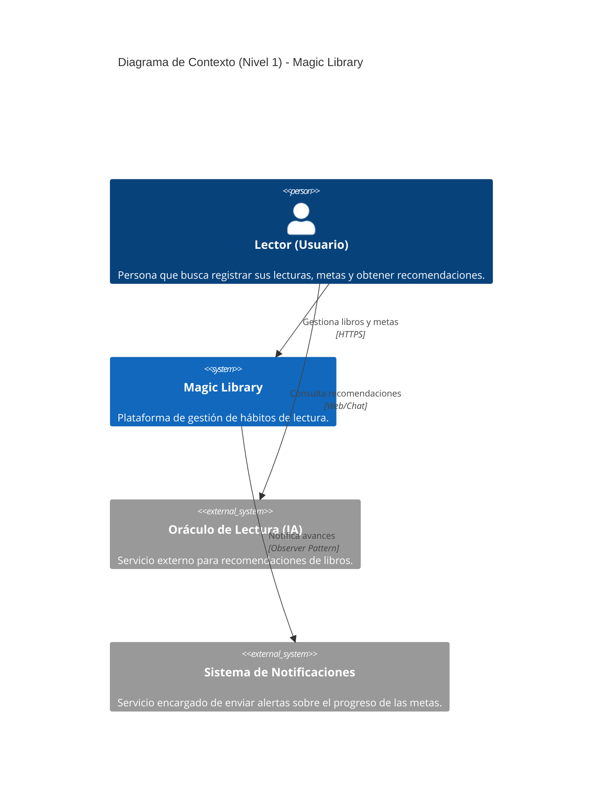

# Magic Library - Modelo C4

Esta documentación describe la arquitectura de Magic Library, una plataforma orientada a fomentar hábitos de lectura. El diseño sigue una Arquitectura Hexagonal que separa el dominio del negocio de la infraestructura, permitiendo una evolución tecnológica sostenida.

---

## C4 Nivel 1 - Contexto

**¿Para quién es?** Para cualquier usuario lector interesado en gestionar sus hábitos.

**¿Qué pregunta responde?** Cómo interactúa el usuario con el sistema y sus servicios externos



## C4 Nivel 2 - Contenedores
¿Para quién es? Arquitectos y desarrolladores.

¿Qué pregunta responde? Cuáles son las piezas técnicas grandes y cómo se comunican bajo arquitectura hexagonal


```mermaid
C4Container
    title Diagrama de Contenedores (Nivel 2) - Magic Library en AWS

    Person(lector, "Lector (Usuario)", "Interactúa a través del navegador web.")

    System_Boundary(c1, "Magic Library (Hexagonal)") {
        Container(webApp, "Aplicación Web (Frontend)", "ASP.NET Core MVC", "Entrega las vistas HTML, maneja sesiones y peticiones HTTP.")
        Container(appCore, "Capa de Aplicación y Dominio", "C# Class Library", "Lógica de negocio, servicios (BookService, GoalService) y puertos.")
        Container(infra, "Capa de Infraestructura", "C# Class Library / EF Core", "Adaptadores: Repositorios de Entity Framework (BookRepositoryEf) y Notificadores.")
        ContainerDb(sqlStore, "Base de Datos en la Nube", "AWS RDS (SQL Server)", "Almacenamiento persistente y relacional de libros, usuarios y metas.")
    }

    Rel(lector, webApp, "Accede a las vistas", "HTTPS / HTTP")
    Rel(webApp, appCore, "Invoca lógica de negocio", "Inyección de Dependencias")
    Rel(appCore, infra, "Implementa puertos de persistencia", "Interfaces")
    Rel(infra, sqlStore, "Lee/Escribe datos relacionales", "Entity Framework Core / TCP")

````
## C4 Nivel 3 - Componentes

¿Para quién es? Programadores.

¿Qué pregunta responde? Cómo interactúan las clases concretas (Servicios, Repositorios, Patrones GoF)


```mermaid
 C4Component
    title Diagrama de Componentes (Nivel 3) - Detalle Técnico (Entity Framework)

    Container_Boundary(web, "Capa Web (MVC)") {
        Component(bookCtrl, "BookController", "MVC Controller", "Gestiona flujos visuales del inventario.")
        Component(goalCtrl, "GoalController", "MVC Controller", "Gestiona vistas e interacciones de las metas.")
    }

    Container_Boundary(core, "Capa de Aplicación y Dominio") {
        Component(goalSvc, "GoalService", "Service", "Lógica de metas y notificaciones.")
        Component(bookSvc, "BookService", "Service", "Lógica de libros y recomendaciones.")
        
        Component(igoalRepo, "IGoalRepository", "Interface", "Puerto para metas.")
        Component(ibookRepo, "IBookRepository", "Interface", "Puerto para libros.")
        Component(igoalObs, "IGoalObserver", "Interface", "Puerto para el patrón Observer.")
    }

    Container_Boundary(infra, "Capa de Infraestructura (EF Core)") {
        Component(efGoal, "GoalRepositoryEf", "Adaptador", "Persistencia de metas.")
        Component(efBook, "BookRepositoryEf", "Adaptador", "Persistencia de libros.")
        Component(efUser, "UserRepositoryEf", "Adaptador", "Persistencia de usuarios.")
        Component(efProfile, "UserProfileRepositoryEf", "Adaptador", "Persistencia de perfiles.")
        Component(efRec, "RecommendationRepositoryEf", "Adaptador", "Persistencia de recomendaciones.")
        Component(decorator, "LoggingBookRepository", "Decorator", "Logging dinámico (Patrón Decorator).")
        Component(emailObs, "EmailObserver", "Observer", "Notificación de metas.")
        Component(dbContext, "MagicLibraryContext", "DbContext", "Mapeo ORM.")
    }
    
    Container_Boundary(db, "Infraestructura Cloud") {
        Component(rds, "AWS RDS", "SQL Server", "Base de datos relacional.")
    }

    Rel(goalCtrl, goalSvc, "Llama a")
    Rel(bookCtrl, bookSvc, "Llama a")
    
    Rel(goalSvc, igoalRepo, "Usa")
    Rel(goalSvc, igoalObs, "Notifica a")
    Rel(bookSvc, ibookRepo, "Usa")
    
    Rel(efGoal, igoalRepo, "Implementa")
    Rel(efBook, ibookRepo, "Implementa")
    Rel(emailObs, igoalObs, "Implementa")
    Rel(decorator, ibookRepo, "Envuelve y extiende")
    
    Rel(efGoal, dbContext, "Consulta mediante")
    Rel(efBook, dbContext, "Consulta mediante")
    Rel(dbContext, rds, "Ejecuta SQL")  

  ``` 

  ## Declaracion de uso de IA

  Declaro el uso de inteligencia artificial de manera asistida para darme el código de los diagramas C4, pero no para la toma de decisiones de diseño. La arquitectura y las decisiones de implementación son mi responsabilidad. Supervisé cada uno de los digramas generados y los ajusté según mis necesidades y criterios de diseño. La IA fue utilizada únicamente como una herramienta para acelerar la creación de diagramas y no influyó en la dirección arquitectónica del proyecto.


