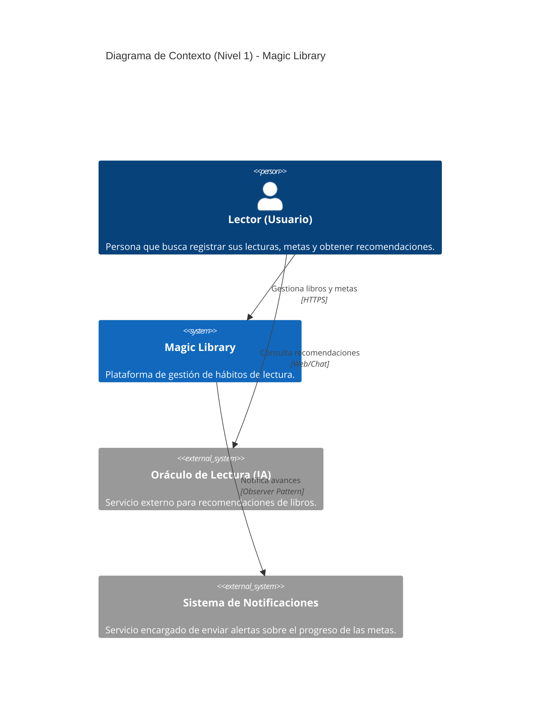

# Magic Library - Modelo C4

Esta documentación describe la arquitectura de Magic Library, una plataforma orientada a fomentar hábitos de lectura. El diseño sigue una Arquitectura Hexagonal que separa el dominio del negocio de la infraestructura, permitiendo una evolución tecnológica sostenida.

---

## C4 Nivel 1 - Contexto

**¿Para quién es?** Para cualquier usuario lector interesado en gestionar sus hábitos.

**¿Qué pregunta responde?** ¿Cómo interactúa el usuario con el sistema y sus servicios externos?

