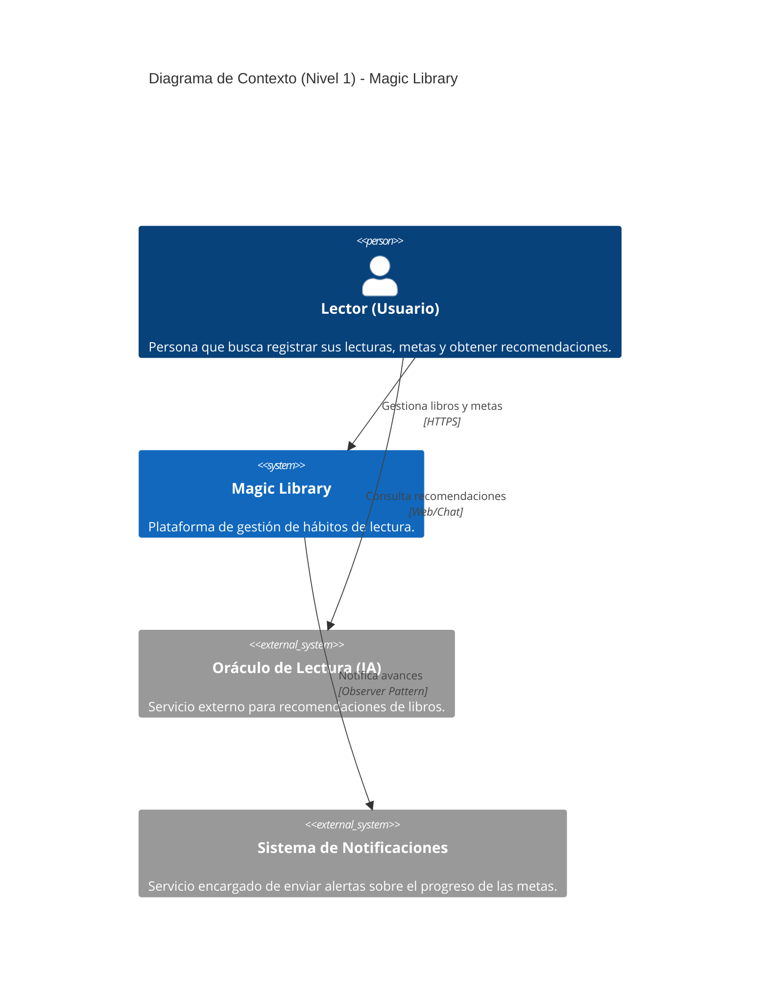

# Magic Library - Modelo C4

Esta documentación describe la arquitectura de Magic Library, una plataforma orientada a fomentar hábitos de lectura. El diseño sigue una Arquitectura Hexagonal que separa el dominio del negocio de la infraestructura, permitiendo una evolución tecnológica sostenida.

---

## C4 Nivel 1 - Contexto

**¿Para quién es?** Para cualquier usuario lector interesado en gestionar sus hábitos.

**¿Qué pregunta responde?** Cómo interactúa el usuario con el sistema y sus servicios externos



## C4 Nivel 2 - Contenedores
¿Para quién es? Arquitectos y desarrolladores.

¿Qué pregunta responde? Cuáles son las piezas técnicas grandes y cómo se comunican bajo arquitectura hexagonal


```mermaid
C4Container
    title Diagrama de Contenedores (Nivel 2) - Magic Library

    Person(lector, "Lector (Usuario)", "Interactúa a través del navegador web.")
    Person(movil, "Usuario Móvil (Futuro)", "Interactúa a través de una futura app.")

    System_Boundary(c1, "Magic Library (Hexagonal)") {
        Container(webApp, "Aplicación Web (Frontend)", "ASP.NET Core MVC", "Entrega las vistas HTML y maneja las sesiones del usuario.")
        Container(apiApp, "API REST", "ASP.NET Core Web API", "Expone los endpoints en formato JSON (Swagger) para libros y metas.")
        Container(appCore, "Capa de Aplicación y Dominio", "C# Class Library", "Lógica de negocio, servicios (BookService, GoalService) y puertos.")
        Container(infra, "Capa de Infraestructura", "C# Class Library", "Adaptadores: Repositorios locales (JSON), Patrones GoF y Notificadores.")
        ContainerDb(jsonStore, "Persistencia", "JSON Files", "Almacenamiento de libros, usuarios y metas.")
    }

    Rel(lector, webApp, "Accede a las vistas", "HTTPS")
    Rel(movil, apiApp, "Consume datos", "HTTPS/JSON")
    Rel(webApp, apiApp, "Consume datos (Opcional)", "HTTPS")
    
    Rel(webApp, appCore, "Invoca lógica", "Inyección de Dependencias")
    Rel(apiApp, appCore, "Invoca lógica", "Inyección de Dependencias")
    
    Rel(appCore, infra, "Implementa puertos", "Interfaces")
    Rel(infra, jsonStore, "Lee/Escribe", "File I/O")

````
## C4 Nivel 3 - Componentes

¿Para quién es? Programadores.

¿Qué pregunta responde? Cómo interactúan las clases concretas (Servicios, Repositorios, Patrones GoF)


```mermaid
C4Component
    title Diagrama de Componentes (Nivel 3) - Detalle Técnico

    Container_Boundary(web, "Capa Web / API") {
        Component(bookCtrl, "BookController", "MVC", "Gestiona flujos y vistas de lectura.")
        Component(goalCtrl, "GoalController", "MVC", "Gestiona vistas de las metas del lector.")
    }

    Container_Boundary(core, "Capa de Aplicación y Dominio") {
        Component(goalSvc, "GoalService", "Service", "Lógica: Cálculo de progreso y notificación.")
        Component(bookSvc, "BookService", "Service", "Lógica: Gestión de estado del libro.")
        
        Component(igoalRepo, "IGoalRepository", "Interface", "Puerto de persistencia de metas.")
        Component(ibookRepo, "IBookRepository", "Interface", "Puerto de persistencia de libros.")
        Component(igoalObs, "IGoalObserver", "Interface", "Puerto para Observadores.")
    }

    Container_Boundary(infra, "Capa de Infraestructura") {
        Component(jsonGoal, "JsonGoalRepository", "Adaptador", "Persistencia JSON.")
        Component(jsonBook, "JsonBookRepository", "Adaptador", "Persistencia JSON para libros.")
        Component(factory, "RepositoryFactory", "Factory", "Instanciación según entorno.")
        Component(decorator, "LoggingBookRepository", "Decorator", "Logging dinámico sin alterar lógica.")
        Component(emailObs, "EmailObserver", "Observer", "Implementación de notificación por email.")
    }

    Rel(goalCtrl, goalSvc, "Llama a")
    Rel(bookCtrl, bookSvc, "Llama a")
    
    Rel(goalSvc, igoalRepo, "Usa")
    Rel(goalSvc, igoalObs, "Notifica a", "Patrón Observer")
    Rel(bookSvc, ibookRepo, "Usa")
    
    Rel(jsonGoal, igoalRepo, "Implementa")
    Rel(jsonBook, ibookRepo, "Implementa")
    Rel(emailObs, igoalObs, "Implementa")
    
    Rel(factory, jsonGoal, "Instancia")
    Rel(factory, jsonBook, "Instancia")
    Rel(decorator, ibookRepo, "Envuelve y extiende")

  ``` 

  ## Declaracion de uso de IA

  Declaro el uso de inteligencia artificial de manera asistida para darme el código de los diagramas C4, pero no para la toma de decisiones de diseño. La arquitectura y las decisiones de implementación son mi responsabilidad. Supervisé cada uno de los digramas generados y los ajusté según mis necesidades y criterios de diseño. La IA fue utilizada únicamente como una herramienta para acelerar la creación de diagramas y no influyó en la dirección arquitectónica del proyecto.


